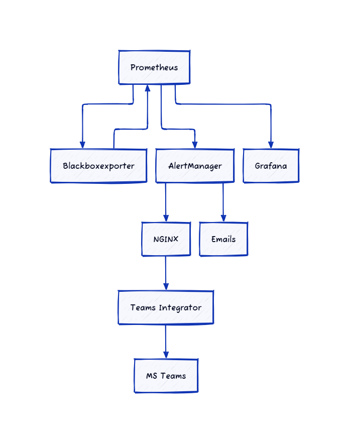

# Monitoring and Alerting Setup

## Components and Interactions

### Prometheus (Port 9090)
Prometheus is the central monitoring system that collects and stores metrics. It scrapes metrics from various targets, including the Blackbox Exporter.

### Blackbox Exporter (Port 9115)
The Blackbox Exporter probes endpoints over HTTP, HTTPS, DNS, TCP, and ICMP. It allows Prometheus to monitor "black box" systems by sending requests and measuring response times and statuses.

### Teams Integrator (Port 2000)
This component forwards Prometheus alerts to Microsoft Teams. It converts incoming Prometheus alerts into Microsoft Teams message cards.

### Alertmanager (Port 9093)
Alertmanager handles alerts sent by Prometheus. It takes care of deduplicating, grouping, and routing alerts to the correct receiver integration, such as MS Teams.

### Grafana (Port 3000)
Grafana is used for visualizing the metrics collected by Prometheus. It can create dashboards and graphs based on the Prometheus data.

### Nginx (Port 443)
Nginx serves as a reverse proxy and load balancer for the entire setup, providing HTTPS access to the monitoring stack.

## Data Flow

1. **Prometheus** scrapes metrics from various targets, including the Blackbox Exporter.
2. The **Blackbox Exporter** probes network endpoints and provides metrics to Prometheus.
3. **Prometheus** evaluates alert rules and sends alerts to Alertmanager.
4. **Alertmanager** processes the alerts and can send them to MS Teams via the Prometheus MS Teams component.
5. **Grafana** queries Prometheus for data visualization.
6. **Nginx** provides secure access to the entire monitoring stack and every component communicates to each other component using NGINX.

**Note**

- Whenever target files are created please ensure environment variables are always (Dev, Test, Stage or Prod) and don't use lowercase.
- Whenever new server is added or new target files with new servers added, ensure the exporter_metrics.yaml has an entry for it to probe system metrics that are validated against alert_rules.yaml.

